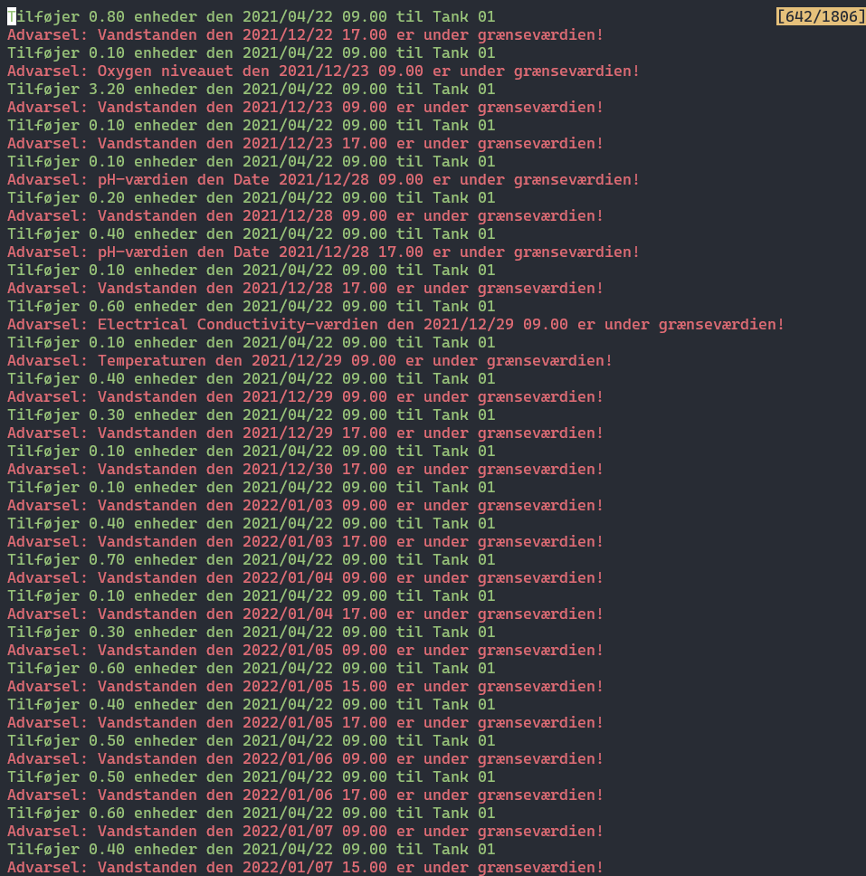
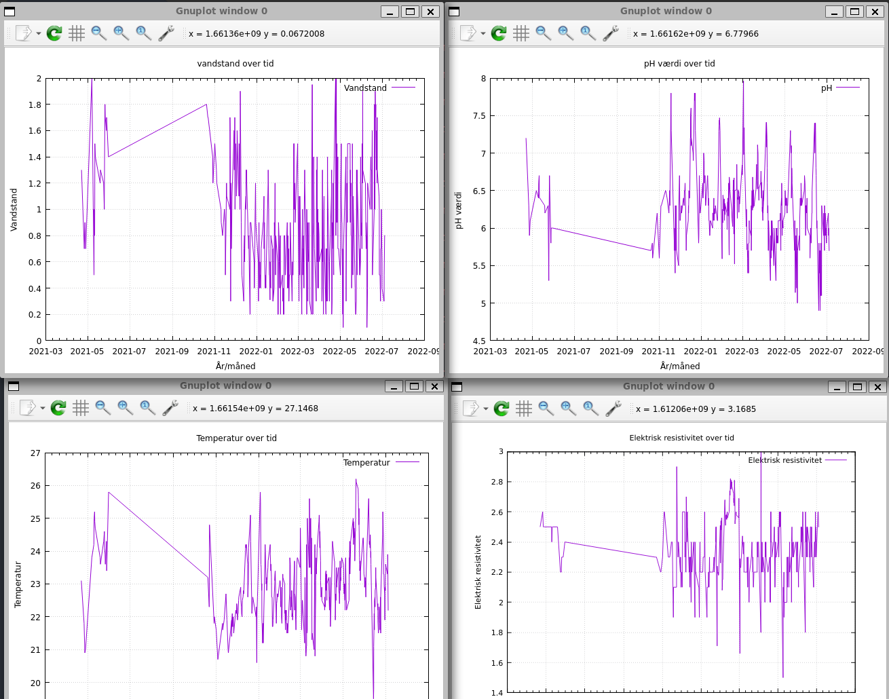

# AAU P1 projekt - CCT årgang 2023
## Udarbejdet af Alexander, Marie, Tobias, Valdemar, Vera og Victor

## Beskrivelse
Dette GitHub repository indeholder alt koden bag vores P1 projekt på Cyber- og computerteknologi studiet på Aalborg Universitet i København

## Forudsætninger
Før du går i gang med at køre programmet, skal du sikre dig, at følgende værktøjer er installeret på din computer:
* GCC (GNU Compiler Collection)
* Gnuplot (Anvendes til at lave visuelle grafer)
    * Windows: `winget install -e --id gnuplot.gnuplot` eller http://tmacchant33.starfree.jp/gnuplot_files/gp610-20230826-win64-mingw.zip
    * Mac: `brew install gnuplot`
    * Linux: `apt install gnuplot`
* CSV-datafil placeret i roden af denne mappe
    * Filnavnet på csv-filen skal matche hvad der er defineret i `main.c`
    * F.eks. `#define FILENAME "Data_T01.csv"`
* Programmet anvender som standard farver i de fleste print til terminalen. Hvis din computer/terminal **IKKE** understøtter farver skal du kommenterer følgende linje i `main.c`
    * `#define ENABLE_COLORS // Kommenter denne linje ud for at deaktivere farver`

## Opsætning/kørsel

1. Hent dette GitHub repository ned på din computer, enten ved at trykke på "Code --> Download Zip" eller ved at køre følgende kommando i terminalen:
```bash
git clone https://github.com/ViggoGaming/AAU-P1.git
```

2. Tilgå nu mappen via følgende kommando:
```bash
cd AAU-P1
```

3. Nu er det tid til at kompilere programmet. 

    Her kan `gcc` anvendes til at kompilere både `main.c` og `client.c` hver for sig:

    ```bash
    # Kompilerer serveren
    gcc -o server main.c
    # Kompilerer klienten
    gcc -o client client.c
    ```


Alternativt kan `make` kommandoen anvendes til automatisk at kompilere begge programmer:
```bash
make all
```

4. Nu kan serveren og klienten køres hver for sig.

## Skærmbilleder

### Advarsler/alamering når en værdi i tanken er under angivet grænseværdi 


### Automatisk generede grafer via Gnuplot


### Kommunikation over internettet via én socket forbindelse fra `klient --> server`

